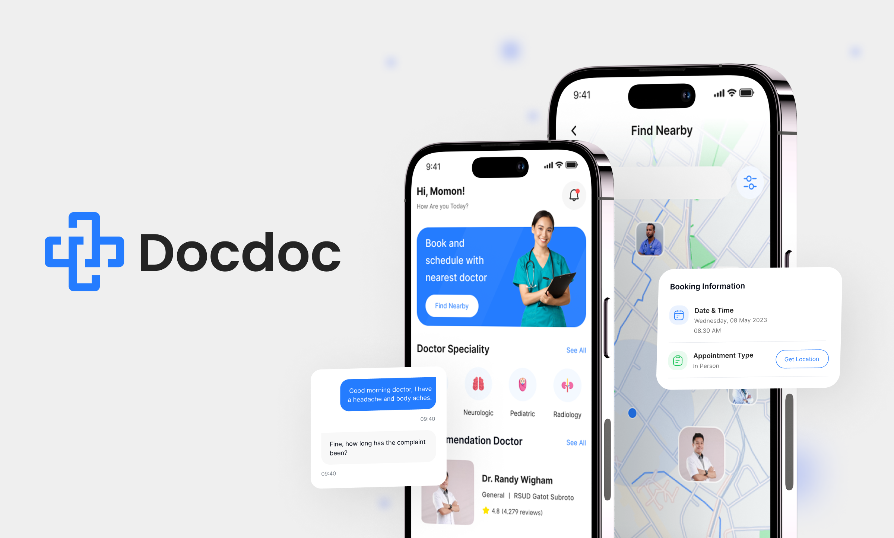

# Docdoc



---

#### This project is for testing purposes and is not yet complete. It is continuously being developed, with new features being added over time.
---
### Releases
You can find the application in the **Releases** section or by following this [link](https://github.com/ahvvad/Docdoc/releases).

---
## Overview  
This Flutter-based application follows a structured approach, integrating best practices in **state management, authentication, API handling, and CI/CD**.  

### Core Features  
- **System Design:** Clean architecture for scalability.  
- **GitHub Workflow:** Structured branching and PR management.  
- **Onboarding & Authentication:** Smooth onboarding, secure login/signup, API validation.  
- **Flutter Flavors:** Multi-environment support for Android & iOS.  
- **CI/CD:** Automated builds & deployments via Fastlane, Firebase App Distribution, and GitHub Actions.  
- **Home Screen:** Responsive UI with API-driven content.  
- **Security:** Secure token storage and authentication.  
- **API Handling:** Error management and data filtering.  
- **Chat System:** Real-time messaging.  

This project ensures a **scalable, efficient, and maintainable** Flutter application.  

---
## Project Structure  

Follow this structure when modifying or contributing to ensure code consistency.  

```
/lib
│── core
│   │── DI (get_it)
│   │── Networking (Dio + Retrofit)
│   │── Routing
│   │── Helpers
│   │── Theming
│   └── Widgets
│
└── features
    └── home
        │── data
        │   │── models
        │   └── repo
        │── logic
        │   └── cubit/states
        └── UI
            └── screens/widgets
```
---
## Gallery


---

### Explore the UI through [this link](preview)

#### **Contact me anytime if you have questions.** : [Here](https://linktr.ee/userahmed)
